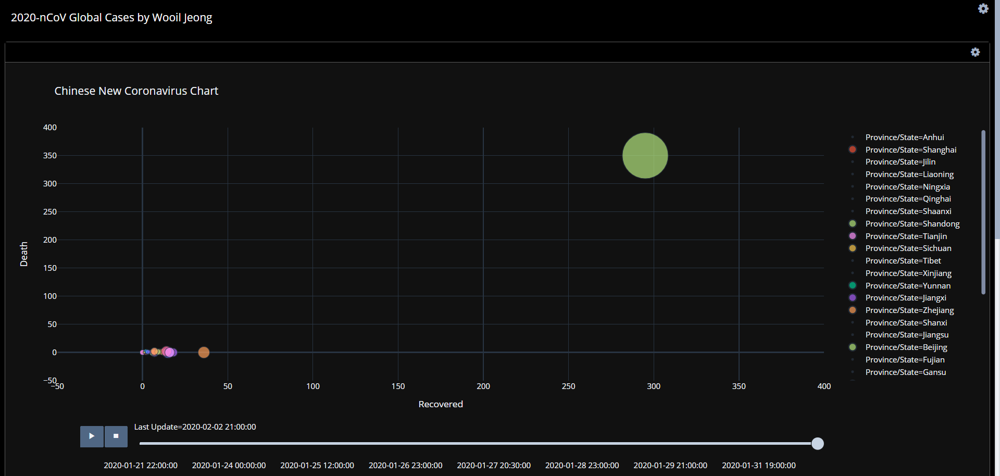
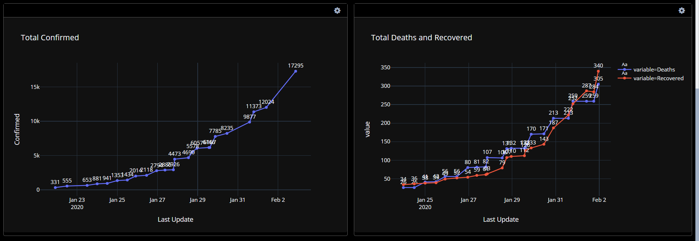

## 2020-nCoV Global Cases by Wooil Jeong

- Wooil Jeong  
[2020-nCoV Global Cases by Wooil Jeong](https://plot.ly/dashboard/coronavirus:34/present#/)  
[Blog](https://wooiljeong.github.io/etc/corona_dash/)  
[Github Repository](https://github.com/WooilJeong/novel_coronavirus)  

- Novel Coronavirus (2019-nCoV) Cases, provided by JHU CSSE  
[Dashboard](https://gisanddata.maps.arcgis.com/apps/opsdashboard/index.html#/bda7594740fd40299423467b48e9ecf6)  
[Data Sheets](https://docs.google.com/spreadsheets/d/1yZv9w9zRKwrGTaR-YzmAqMefw4wMlaXocejdxZaTs6w/htmlview?usp=sharing&sle=true#)  
